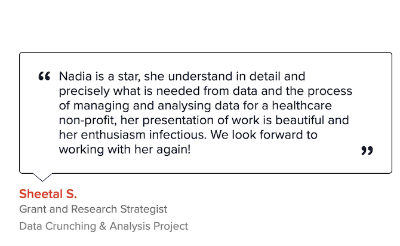

I work with organizations to solve problems and gain insights using data at [oaiti.org](https://oaiti.org). My specialty is in building automated and reproducible analytics solutions, interactive web applications and reports using the **R** programming language.

Recently I have been involved in projects on showcasing impact, for nonprofits and resource constrained organizations.

Check out my [**Profile**](https://www.catchafire.org/profiles/359056/impact/) on Catchafire!

        

