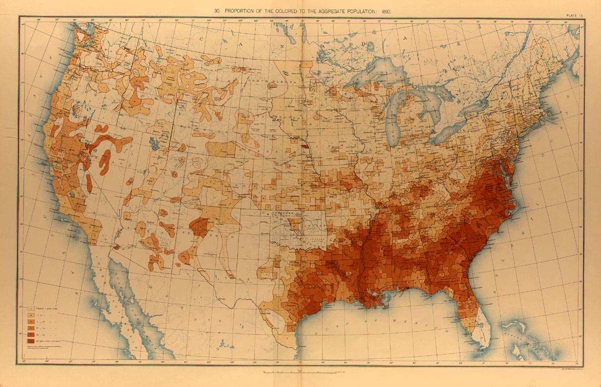
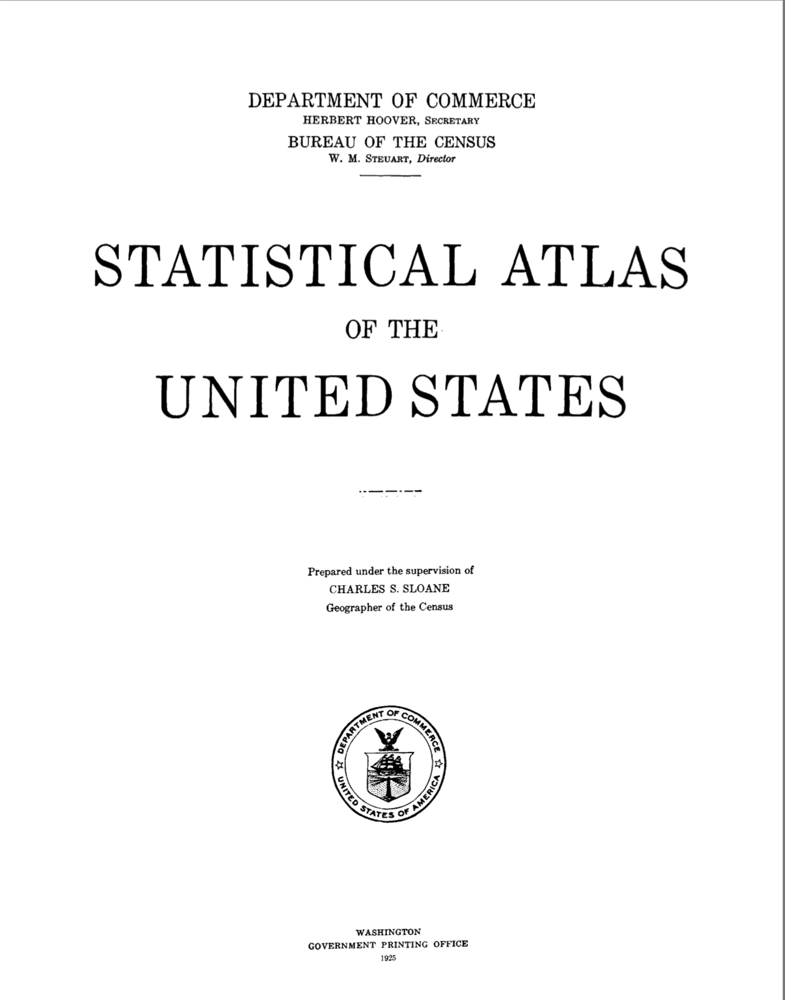
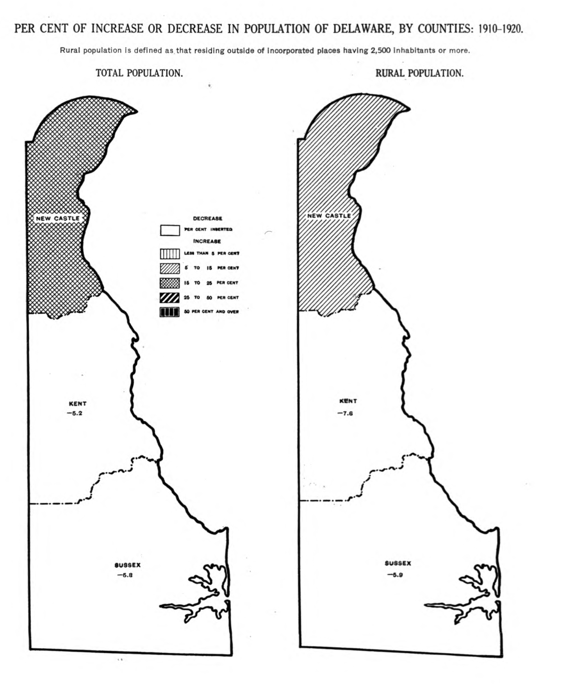
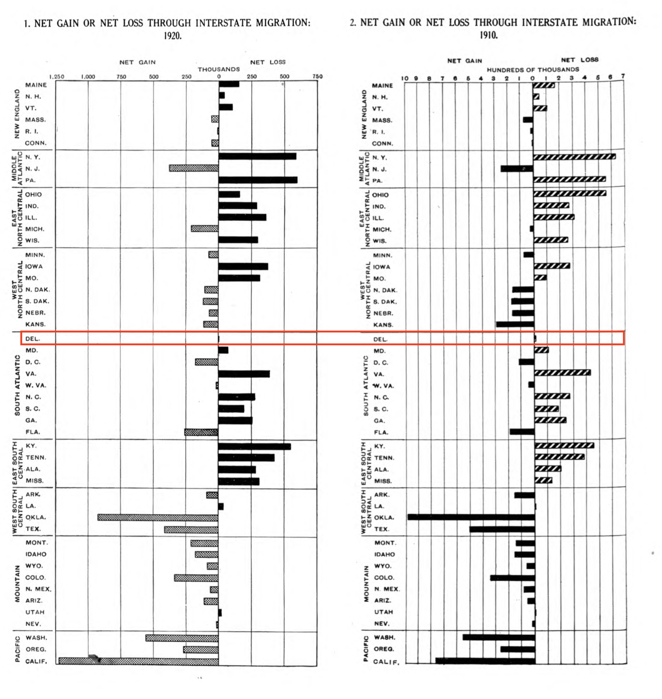

```{r setup, include=FALSE}
knitr::opts_chunk$set(echo = TRUE)
```
## Agenda

- topic 1
- topic 2
- topic 3

# History of the US Census

## US Census Timeline

- bullet 1
- bullet 2

## Data Visualization in the 1800s

```{r, echo=FALSE}

```

## The Statistical Atlas

In fact, up until recently, the Statistical Atlas had been published and released for each Census since 1870! A large compilation of data visualizaitons based on census data:

[1920 Statistical Atlas](https://fraser.stlouisfed.org/files/docs/publications/stat1925/statatlas1925.pdf)

```{r, echo=FALSE, out.width="30%"}

```

## Delaware Population (1920)

```{r, echo=FALSE, out.width="50%", fig.align='center'}

```

## USA Population Density (1920)

```{r, echo=FALSE, out.width="65%", fig.align='center'}
knitr::include_graphics("images/popdens.png")
```

## Migration by State (1920)

```{r, echo=FALSE, out.width="60%", fig.align='center'}

```

# Nearly 100 years later, computers make this task MUCH easier...

## Tidycensus Overview

## Variable Search

## Load Var Function

- getting api key

## What is Tidy Data

All of the tidyverse packages operate easily when you have data in this structure!

Three interrelated rules:

1. Each variable must have its own column.
2. Each observation must have its own row.
3. Each value must have its own cell.

```{r, echo=FALSE, out.width="60%", fig.align='center'}
knitr::include_graphics("images/tidy.png")
```
*https://r4ds.had.co.nz/tidy-data.html#fig:tidy-structure* 

## Steps Through The Analysis

## Load Libraries

```{r,messages = FALSE, results='hide'}
library(tidyverse)
library(sf)
library(tigris)
library(tidycensus)

```

## Your Choices!

1. Get an API Key from http://api.census.gov/data/key_signup.html

```{r, eval = FALSE}
census_api_key("<YOUR API KEY>")
demo_variables <- # define the variables you want to analyze here
de_census_data <- get_acs(geography = "tract",
  state = "DE",
  variables = demo_variables,
  geometry = TRUE,
  cb = TRUE)
```

OR

2. Load de_census_data.RData

```{r}
load("data/de_census_data_export.RData")
```

## Clean 

- No need to do this if you used Choice 2

```{r, eval=FALSE, tidy.opts=list(width.cutoff = 15)}
de_census_data_clean <- de_census_data %>%
    separate(col = NAME, into = c("Census_Tract", "County", "State"), sep = ",") %>%
    separate(col = Census_Tract, into = c("Census", "Tract", "Number"), sep = " ") %>%
    setnames(old=c( "Number"), new=c("Census_Tract_Number"))
```

## Now let's recreate that map we saw

## Subset only Wilmington

```{r}
# Wilmington Tracts - ask Eli where to find these numbers
Wilm_census_data <- de_census_data_clean %>%
  filter(Census_Tract_Number %in% c(2, 3, 4, 5, 6.01, 6.02, 9, 11, 12, 13, 14, 15, 16, 19.02, 21, 22, 23, 24, 25, 26, 27, 28, 29, 30.02))

```

## Let's Plot EVERYTHING!

```{r, eval=FALSE}
# Plot all our data
ggplot(Wilm_census_data, aes(fill = estimate)) +
  geom_sf() +
  scale_fill_viridis_c() +
  scale_color_viridis_c(guide = FALSE) +
  theme_minimal() +
  coord_sf(crs = 26916, datum = NA) +
  labs(title = "Estimates by Census Tract",
       subtitle = "Wilmington, DE",
       caption = "Data source: 2017 ACS.
       \nData acquired with the R tidycensus package.",
       fill = "ACS estimate") +
  facet_wrap(~variable)
```

## What's an issue here?

```{r, echo=FALSE}
# Plot all our data
ggplot(Wilm_census_data, aes(fill = estimate)) +
  geom_sf() +
  scale_fill_viridis_c() +
  scale_color_viridis_c(guide = FALSE) +
  theme_minimal() +
  coord_sf(crs = 26916, datum = NA) +
  labs(title = "Estimates by Census Tract",
       subtitle = "Wilmington, DE",
       caption = "Data source: 2017 ACS.
       \nData acquired with the R tidycensus package.",
       fill = "ACS estimate") +
  facet_wrap(~variable)
```


## Plotting some Variables

Plot only race/ethnicity

```{r}
## filter the ones we want to see
Wilm_census_race <- Wilm_census_data %>%
  filter(variable %in% c("hispanic", "black", "asian", "white", "foreignborn"))
```


## Looking back: Why was Tidy data useful

R being vectorized allows us to use commands like:

* facet
* group_by

## Recreating Maps/Other Analysis


## Next steps
